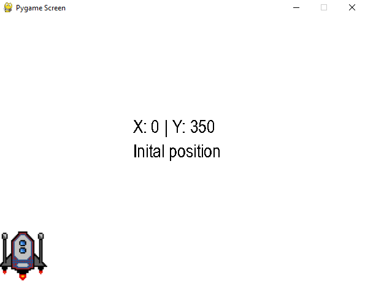
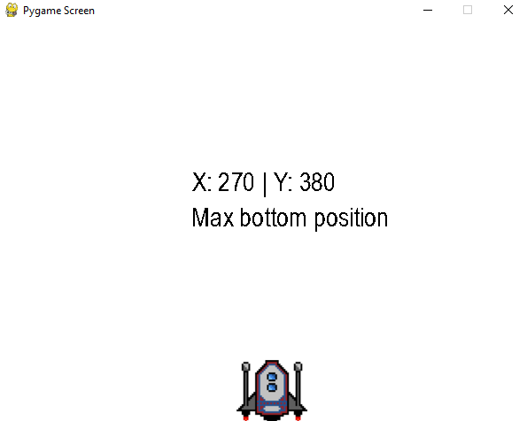
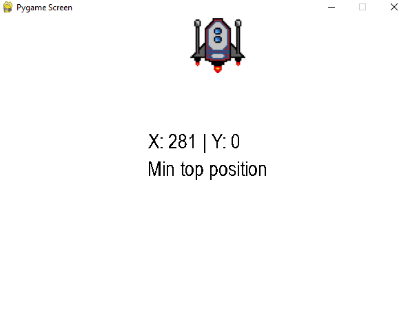
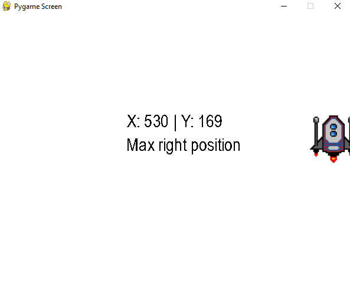
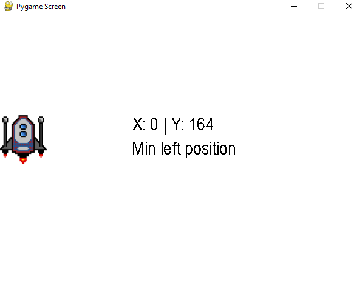

# spaceship-position
Project developed to study some functions of the pygame library.

## some images of project working
######  initial position

######  max bottom position

######  min top position

######  max right position

######  min left position

